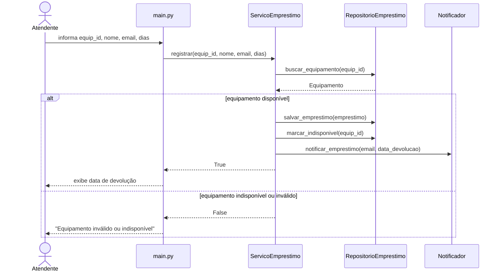
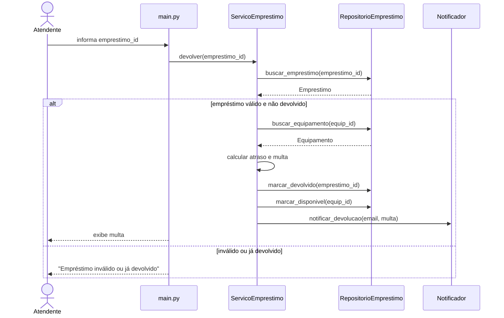
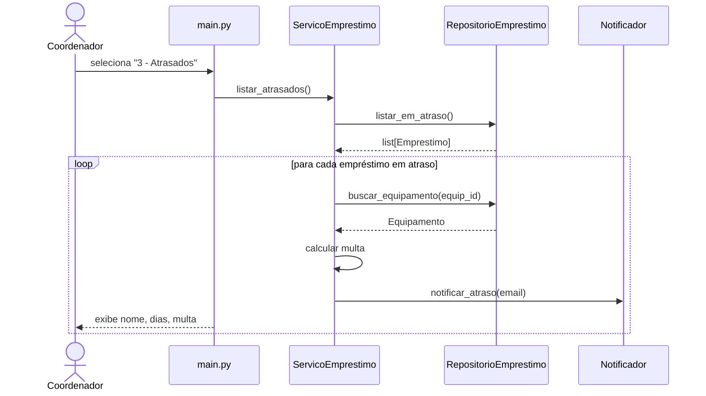

# Diagramas — v2.0

## Decomposição em camadas

A arquitetura em camadas decidida no ADR-001 distribui o sistema em quatro módulos, cada um com uma responsabilidade distinta:

| Camada | Módulo | Responsabilidade | Justificativa |
|--------|--------|-----------------|---------------|
| **Apresentação** | `main.py` | Interface CLI: menu, leitura de entrada, exibição de resultados | Isola a interação com o usuário — trocar CLI por web ou batch exige mudar apenas este módulo |
| **Serviço** | `services/servico_emprestimo.py` | Orquestração das regras de negócio: registrar, devolver, listar atrasados | Concentra a lógica de negócio em um único lugar — nenhuma regra mora na interface nem na persistência |
| **Serviço** | `services/notificador.py` | Envio de notificações (e-mail, console) | Separado do serviço principal porque muda por motivo diferente (canal de comunicação vs. regra de negócio) — SRP |
| **Persistência** | `repositories/repositorio_emprestimo.py` | Armazenamento e recuperação de equipamentos e empréstimos | Encapsula o mecanismo de persistência — trocar memória por banco exige mudar apenas este módulo |
| **Modelos** | `models/equipamento.py` | Entidade de domínio: dados do equipamento | Classe de dados pura, sem dependência de infraestrutura — usada por todas as camadas acima |
| **Modelos** | `models/emprestimo.py` | Entidade de domínio: dados do empréstimo | Idem — representa o registro de empréstimo com tipagem explícita via dataclass |

## Diagramas de sequência

### UC01 — Registrar Empréstimo

### UC02 — Registrar Devolução

### UC03 — Listar Empréstimos em Atraso

## Assinaturas extraídas dos diagramas

### ServicoEmprestimo
- `registrar(equipamento_id, usuario_nome, usuario_email, dias) -> bool`
- `devolver(emprestimo_id) -> None`
- `listar_atrasados() -> None`

### RepositorioEmprestimo
- `buscar_equipamento(id) -> Equipamento`
- `salvar_emprestimo(emprestimo) -> None`
- `buscar_emprestimo(id) -> Emprestimo`
- `marcar_indisponivel(equip_id) -> None`
- `marcar_disponivel(equip_id) -> None`
- `marcar_devolvido(emprestimo_id) -> None`
- `listar_em_atraso() -> list`
- `proximo_id_emprestimo() -> int`

### Notificador
- `notificar_emprestimo(email, data_devolucao) -> None`
- `notificar_devolucao(email, multa) -> None`
- `notificar_atraso(email) -> None`
